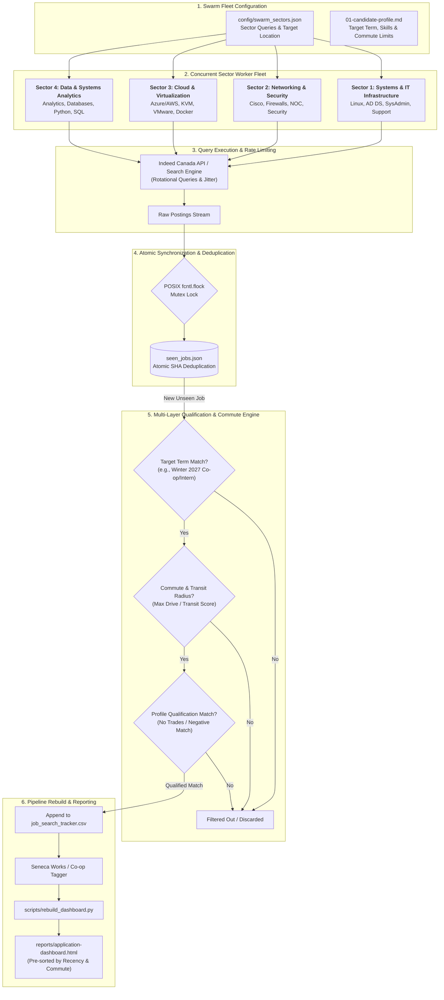

# /indeed-swarm-scraper — Multi-Sector Indeed Swarm Scraper

You are executing the **multi-agent Indeed Swarm Scraper workflow** targeting **Indeed** (`indeed.ca` / `indeed.com`).

The swarm scraper partitions the search space across **specialized sector subagents / daemons** defined in `config/swarm_sectors.json`, executing parallel surveillance loops while enforcing atomic state management, candidate profile qualification criteria, and user-configured commute thresholds.

---

## Sector Architecture & Division of Responsibility



### Configurable Sector Fleet:
Sectors and queries are defined in `config/swarm_sectors.json` (configured via `/setup` or edited manually). Examples:
1. **Systems & IT Infrastructure:** Linux, Systems Administration, Active Directory, IT Support, Datacenter.
2. **Networking & Security:** Network Administration, Cisco Routing/Switching, Firewalls, NOC Operations, Security.
3. **Cloud, DevOps & Software:** AWS/Azure, Kubernetes, DevOps, Software Engineering, Python, Full Stack.
4. **Data & Analytics:** Data Analysis, Data Engineering, Business Intelligence, Machine Learning.

---

## Invocation & Arguments

The user triggers this command by saying:
- `/indeed-swarm-scraper`
- `indeed-swarm-scraper`
- `run indeed swarm scraper`
- `swarm scrape indeed`

`$ARGUMENTS` may contain:
- `--interval <seconds>`: Loop interval between query passes (default: 120)
- `--hours-old <hours>`: Max posting age in hours (default: 336)
- `--from-date <YYYY-MM-DD>`: Scrape all postings published from this date onward (e.g. `--from-date 2026-09-01`)
- `--duration <seconds>`: Total execution time before cleanly stopping (e.g. `--duration 1200` for 20 minutes)
- `--limit <n>`: Results limit per query (default: 10)

---

## Execution Workflow

1. **Launch Fleet:**
   Run the master swarm script:
   ```bash
   python3 scripts/scrape_indeed_swarm.py --interval 120 --from-date 2026-09-01
   ```
   Or deploy dedicated background subagents via `invoke_subagent`, each executing:
   ```bash
   python3 scripts/scrape_indeed_sector_daemon.py --sector <sector_name> --interval 120 --from-date 2026-09-01
   ```

2. **Deduplication & Concurrency:**
   All sector daemons synchronize through atomic POSIX file locks (`fcntl.flock`) against `job_scraper/seen_jobs.json`.

3. **Qualification & Commute Rules:**
   - Term: Aligned with candidate profile target term (Co-op, Internship, Entry-Level, or Full-Time).
   - Geographic Radius: Within configured maximum driving/commute distance from candidate location.
   - Profile Match: Qualified against target roles and skills in `01-candidate-profile.md` and `config/swarm_sectors.json`.
   - Spam Filtering: Automatically filters unrelated manual labor trades and seniority mismatches.

4. **Auto-Rebuild:**
   Whenever new qualified postings are identified, the system automatically rebuilds `job_search_tracker.csv` and `reports/application-dashboard.html` via `scripts/rebuild_dashboard.py`.
