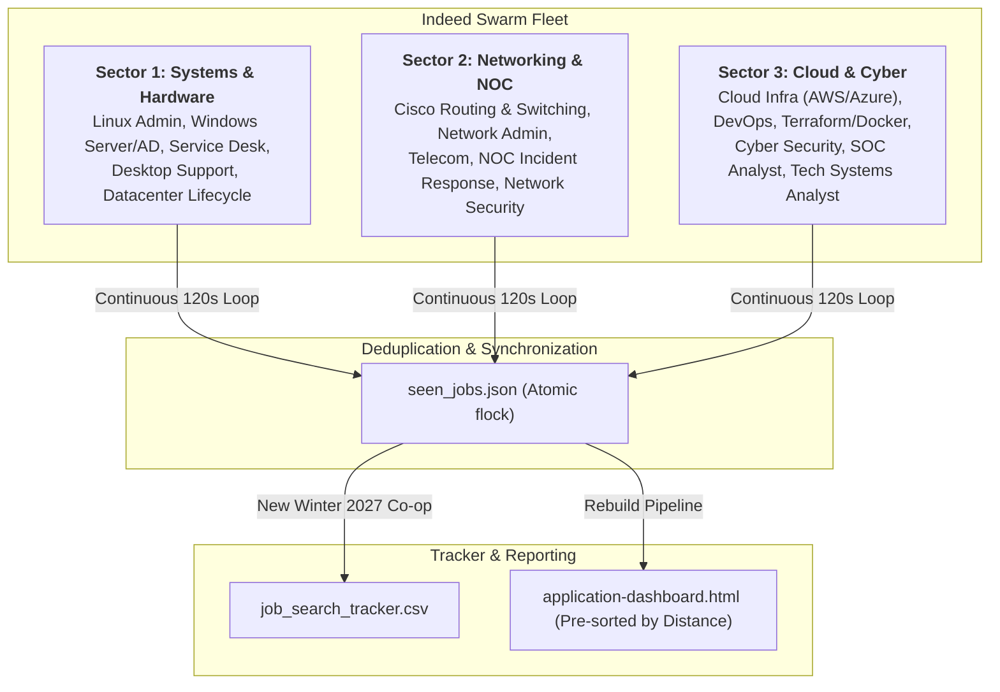

# /indeed-swarm-scraper — Multi-Sector Indeed Swarm Scraper

You are executing the **multi-agent Indeed Swarm Scraper workflow** targeting **Indeed** (`indeed.ca` / `indeed.com`).

The swarm scraper partitions the search space across **specialized sector subagents / daemons** defined in `config/swarm_sectors.json`, executing parallel surveillance loops while enforcing atomic state management, candidate profile qualification criteria, and user-configured commute thresholds.

---

## Sector Architecture & Division of Responsibility



### Sector Coverage Matrix:
1. **Sector 1 (`systems_hardware`):**
   - *Target Domains:* Linux Systems Administration, Windows Server & Active Directory, Enterprise Service Desk, Desktop Support, Hardware Deployment, and Datacenter Operations.
   - *Queries:* `Linux Co-op Winter 2027`, `Systems Administrator Co-op Winter 2027`, `Windows Server Active Directory Co-op`, `IT Support Co-op`, `Desktop Support Co-op`, `Service Desk Technician Co-op`, `Hardware Technician Co-op`, `Datacenter Technician Co-op`, `IT Workplace Services Co-op`.
2. **Sector 2 (`networking_noc`):**
   - *Target Domains:* Cisco Networking, Network Administration, Routing & Switching, Firewalls, Telecom, NOC Monitoring & Incident Response, Network Security.
   - *Queries:* `Network Administrator Co-op Winter 2027`, `Network Support Co-op Winter 2027`, `Cisco Co-op Winter 2027`, `NOC Analyst Co-op Winter 2027`, `NOC Technician Co-op Winter 2027`, `Telecom Technician Co-op`, `Network Infrastructure Co-op`, `Network Security Co-op`.
3. **Sector 3 (`cloud_cyber`):**
   - *Target Domains:* Cloud Infrastructure (AWS, Azure), Infrastructure as Code (Terraform), Docker/Kubernetes, DevOps, Cyber Security, Information Security, SOC Analysis, Technical Systems Analyst.
   - *Queries:* `Cloud Infrastructure Co-op Winter 2027`, `Cloud Engineer Co-op Winter 2027`, `DevOps Co-op Winter 2027`, `Cyber Security Co-op Winter 2027`, `Information Security Co-op Winter 2027`, `SOC Analyst Co-op Winter 2027`, `Vulnerability Analyst Co-op`, `Technical Systems Analyst Co-op`, `OT Cybersecurity Co-op`.

---

## Invocation & Arguments

The user triggers this command by saying:
- `/indeed-swarm-scraper`
- `indeed-swarm-scraper`
- `run indeed swarm scraper`
- `swarm scrape indeed`

`$ARGUMENTS` may contain:
- `--interval <seconds>`: Loop interval between query passes (default: 120)
- `--hours-old <hours>`: Max posting age in hours (default: 336)
- `--from-date <YYYY-MM-DD>`: Scrape all postings published from this date onward (e.g. `--from-date 2026-09-01`)
- `--duration <seconds>`: Total execution time before cleanly stopping (e.g. `--duration 1200` for 20 minutes)
- `--limit <n>`: Results limit per query (default: 10)

---

## Execution Workflow

1. **Launch Fleet:**
   Run the master swarm script:
   ```bash
   python3 scripts/scrape_indeed_swarm.py --interval 120 --from-date 2026-09-01
   ```
   Or deploy 3 dedicated background subagents via `invoke_subagent`, each executing:
   ```bash
   python3 scripts/scrape_indeed_sector_daemon.py --sector <sector_name> --interval 120 --from-date 2026-09-01
   ```

2. **Deduplication & Concurrency:**
   All 3 sector daemons synchronize through atomic POSIX file locks (`fcntl.flock`) against `job_scraper/seen_jobs.json`.

3. **Curriculum & Commute Rules:**
   - Term: Winter 2027 Co-op (January 2027 start) exclusively.
   - Geographic Cap: $\le 70\text{ km}$ driving distance from Newmarket, ON.
   - Profile Match: Seneca Polytechnic Computer Systems Technology (CTYC).
   - Strict Exclusions: Automatically filters software developers, coding, data science, data analytics, AI/ML, business intelligence, business analysis, commerce, finance, sales, and trades.

4. **Auto-Rebuild:**
   Whenever a new qualified Winter 2027 Co-op is identified, the system automatically rebuilds `job_search_tracker.csv` and `reports/application-dashboard.html`.
