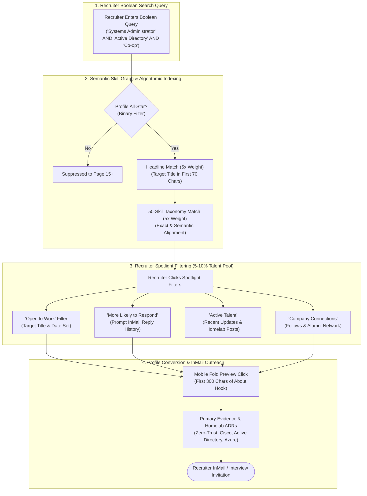

# Modern LinkedIn Profile Optimization Playbook (2026 Edition)
*Engineered for IT Infrastructure, Systems Administration, and Cloud Engineering Candidates*

---

## 1. Algorithmic Architecture & Recruiter Search Heuristics

In 2026, LinkedIn's recruiter search algorithm functions as an **AI-powered Semantic Skill Graph** rather than a primitive keyword counter. To achieve top-tier indexing for enterprise IT co-op and entry-level roles, a profile must satisfy both algorithmic ranking criteria and human hiring manager psychology.

### Algorithmic Ranking Gates:

| Hierarchy | Ranking Metric | Weight | Algorithmic Mechanism |
| :--- | :--- | :--- | :--- |
| **Tier 0** | **Profile Completeness (All-Star Status)** | **Binary Gate** | Profiles lacking any core section (Photo, Location, Headline, About, Experience, Education, Skills) are severely downranked in Boolean searches. |
| **Tier 1** | **Headline Search Weight** | **5x Weight** | The headline is indexed with 5x the weight of any other field. The first **65–70 characters** are visible in search results, notifications, and feed comments. |
| **Tier 1** | **Boolean Exact & Semantic Skills Match** | **5x Weight** | Recruiters filter candidates using pre-populated ATS skill taxonomies. Using all **50 skill slots** and pairing exact skills with job entries is mandatory. |
| **Tier 1.5**| **Recruiter Spotlights ("More Likely to Respond" & "Active Talent")** | **4x Weight** | Recruiters click Spotlight tabs to filter thousands of candidates down to the 5–10% most likely to engage. Triggered by active logins, recent profile updates, and "Open to Work". |
| **Tier 2** | **Network Proximity (Degree of Connection)** | **3x Weight** | Search results prioritize 1st and 2nd-degree connections. Setting profile CTA to **Connect** rather than **Follow** directly broadens recruiter visibility. |

| **Tier 3** | **Dwell Time & "See More" Click-Through** | **2x Weight** | LinkedIn measures user dwell time on your profile. A compelling first 300 characters in the About section drives click-throughs and signals high profile value. |

### Recruiter Search & Indexing Funnel



---

## 2. Recruiter Boolean Search Archetypes

Recruiters at target organizations (Magna International, TD Bank, RBC, Hospital IT, Regional Municipalities, QuadReal) run strict Boolean queries on LinkedIn Recruiter.

### The Canonical Canadian IT Co-op Search String:
```text
("Systems Administrator" OR "System Administrator" OR "IT Administrator" OR "Junior Systems Administrator" OR "IT Support" OR "Desktop Support" OR "IT Operations" OR "Service Desk Analyst") 
AND ("Active Directory" OR "AD" OR "Group Policy" OR "GPO" OR "DHCP" OR "DNS") 
AND ("Co-op" OR "Internship" OR "Intern" OR "Work Term" OR "Student")
AND ("Linux" OR "Debian" OR "Ubuntu" OR "Cisco" OR "Azure")
NOT ("Senior" OR "Lead" OR "Principal" OR "Manager" OR "Director")
```

### Strategic Implications:
1. **Acronym & Full-Form Pairing:** Always include both the full term and the industry acronym in your profile text (e.g., `Active Directory (AD DS)`, `Group Policy Objects (GPOs)`, `Dynamic Host Configuration Protocol (DHCP)`, `Domain Name System (DNS)`, `Virtual Local Area Networks (VLANs)`).
2. **Dual Terminology (Co-op vs. Internship):** Canadian employers alternate between "Co-op" and "Internship/Work Term". Both terms must appear in your headline and summary.
3. **Location Radius Optimization:** Setting your LinkedIn location to `Greater Toronto Area, Canada` ensures you appear in searches centered anywhere across Toronto, Mississauga, Markham, Vaughan, or York Region, avoiding narrow 25-km radius exclusions.

---

## 3. Mastering LinkedIn Recruiter "Spotlights"

When recruiters search, they often face 500+ candidates matching their Boolean string. To prioritize outreach, they click LinkedIn Recruiter's **Spotlight tabs**. Here is how to trigger all 4:

1. **Spotlight 1: "Open to Work" (Top Priority):**
   * *Trigger:* Enable Open to Work with target titles (IT Systems Administrator, Systems Administrator, IT Operations Analyst, Service Desk Analyst) and start date set to Winter 2027.
2. **Spotlight 2: "More Likely to Respond" (AI Behavioral Score):**
   * *Trigger:* Respond to every InMail within 24 hours (even a polite decline preserves your 100% response rate score). Log into LinkedIn at least 3-4 times a week; conduct occasional job searches.
3. **Spotlight 3: "Active Talent":**
   * *Trigger:* Profile updates, commenting on industry posts, or sharing project updates within the last 30 days flags your profile as "Active Talent".
4. **Spotlight 4: "Have Company Connection":**
   * *Trigger:* Follow target company LinkedIn pages (Magna International, TD, RBC, QuadReal, City of Toronto, York Region, Linamar) and connect with Seneca alumni working at those organizations.


---

## 4. Platform Updates & Traps to Avoid

> [!WARNING]
> **Avoid Obsolete Advice (Post-March 2024 Platform Changes):**
> * **Creator Mode is Retired:** LinkedIn eliminated the Creator Mode toggle in March 2024. Creator features (Newsletters, Analytics, LinkedIn Live) are now native to all accounts.
> * **Hashtags Are Removed:** The `#talksabout` section under headlines was deprecated in February 2024. Do not include loose hashtag lists in your profile header.
> * **Do Not "Make Follow Primary":** In `Settings & Privacy > Visibility > Followers`, leave the primary button set to **Connect**. A 1st-degree connection expands your reciprocal network distance; followers remain distant nodes.
> * **No Keyword Stuffing:** Avoid dumping disconnected skill acronyms without narrative context. The semantic parser penalizes unstructured keyword blocks.

---

## 4. Engineering Your Proof Assets

### A. Showcasing Homelab as Professional Engineering
Hiring managers evaluate technical curiosity and architectural rigor. A homelab should never be described as a "hobby."

* **Enterprise Naming:** Frame the setup as *Multi-Zone Virtualized Infrastructure & Cisco Network Lab*.
* **Business-Value Framing:** Focus on security isolation (DMZ vs. LAN), least-privilege access, zero-trust remote administration (eliminating open WAN ports), and automated disaster recovery.
* **Documentation Rigor:** Highlight production artifacts: **5 Architectural Decision Records (ADRs)** and **7 post-mortem incident response reports**.

### B. Translating Small Business & Officiating to Enterprise IT
Enterprise IT requires high operational reliability, calm user communication, and disciplined escalation handling.

* **Newmarket Pressure Washing (Entrepreneurship):**
  - *Technical Alignment:* Preventative maintenance schedules, hardware diagnostics, small engine and high-pressure hydraulic repairs.
  - *Operational Alignment:* Client SLA management, 97%+ customer satisfaction, end-to-end service delivery from quote to invoicing.
* **NMHA Ice Hockey Referee (Officiating):**
  - *Operational Alignment:* 300+ games officiated under Hockey Canada regulatory standards.
  - *Soft Skill Alignment:* Split-second rule interpretation under intense stakeholder scrutiny; calm conflict de-escalation with coaches and team officials.

---

## 5. Outreach & Connection Blueprints (Under 300 Characters)

LinkedIn connection requests sent with a personalized note have a **3x higher acceptance rate**. The platform enforces a strict **300-character limit**.

### Blueprint 1: Target Role Applied (Campus Recruiter)
```text
Hi [Name], I recently applied for the [Job Title] Co-op role at [Company]. As a Seneca CTY student (4.0 GPA) with hands-on Active Directory and Cisco infrastructure lab experience, I would love to connect and follow [Company]’s updates. Thanks! [Your Name]
```
*(260 / 300 characters)*

### Blueprint 2: Seneca Polytechnic Alumni Outreach
```text
Hi [Name], I’m a fellow Seneca student in the Computer Systems Technology (CTY) program (4.0 GPA). I noticed your impressive career path at [Company] and would love to connect and follow your journey in enterprise IT infrastructure. Best, [Your Name]
```
*(252 / 300 characters)*

### Blueprint 3: IT Hiring Manager (Infrastructure / Systems Admin)
```text
Hi [Name], I follow your team’s infrastructure work at [Company]. I’m a Seneca CTY co-op student with a multi-zone virtualized homelab (Cisco ZFW, Cloudflare Zero Trust, Debian/Azure). I would welcome the chance to connect with your team. Best, [Your Name]
```
*(250 / 300 characters)*

---

## 6. Recommendation Acquisition Strategy

Social proof dramatically increases profile conversion rates. Seek 3 distinct recommendations:

### Request 1: Seneca Professor (MST100/200 or OPS145/245)
> *"Hi Professor [Name], I hope you're having a great semester. I’m preparing my profile for Winter 2027 Co-op applications and reflecting on the depth of the [Course Name, e.g., MST200 Server Administration] curriculum. Would you be open to writing a brief 2-3 sentence recommendation highlighting my lab execution in Active Directory and PowerShell automation? I know your schedule is very busy, so no pressure at all, but I would deeply value your endorsement!"*

### Request 2: Commercial Business Client (Newmarket Pressure Washing)
> *"Hi [Client Name], thank you again for your business over the past seasons! I am currently expanding my professional portfolio as I prepare for IT systems roles. Would you be willing to leave a short recommendation on my LinkedIn highlighting my communication, punctuality, and the quality of maintenance work I delivered for your property? I’d be happy to write a testimonial for you as well!"*

### Request 3: Referee Supervisor / NMHA Official
> *"Hi [Supervisor Name], I’m putting together my professional credentials for upcoming technical co-op roles. Would you be comfortable writing a short recommendation speaking to my officiating reliability, rule enforcement, and game-management composure over 300+ games with NMHA? Your perspective on my communication under pressure would mean a great deal!"*

---

## 7. 30-Day Content & Engagement Roadmap

Maintaining activity signals relevance to LinkedIn's algorithm. You do not need to be an influencer—focus on documenting genuine technical milestones:

* **Week 1: Homelab Architecture Post:** Share a clean network topology diagram of your Debian 13 / Cisco IOSv homelab, explaining why you chose Cloudflare Tunnels over port forwarding.
* **Week 2: Academic Milestone Post:** Share a photo of your President's Honour List certificate from Seneca, thanking your systems professors and highlighting a specific AD DS / GPO lab breakthrough.
* **Week 3: Troubleshooting Post:** Write a 150-word post detailing one of your incident post-mortems (e.g., debugging a dynamic NAT overload issue or a DNS forward lookup sync failure).
* **Week 4: Tooling & Scripting Post:** Share a snippet of your PowerShell user-onboarding script (`bulk_users.ps1`) or your Bash `virsh managedsave` disaster recovery routine.
