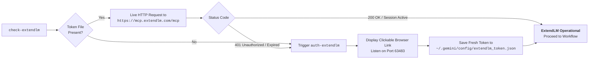
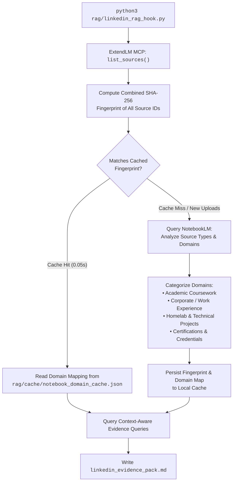
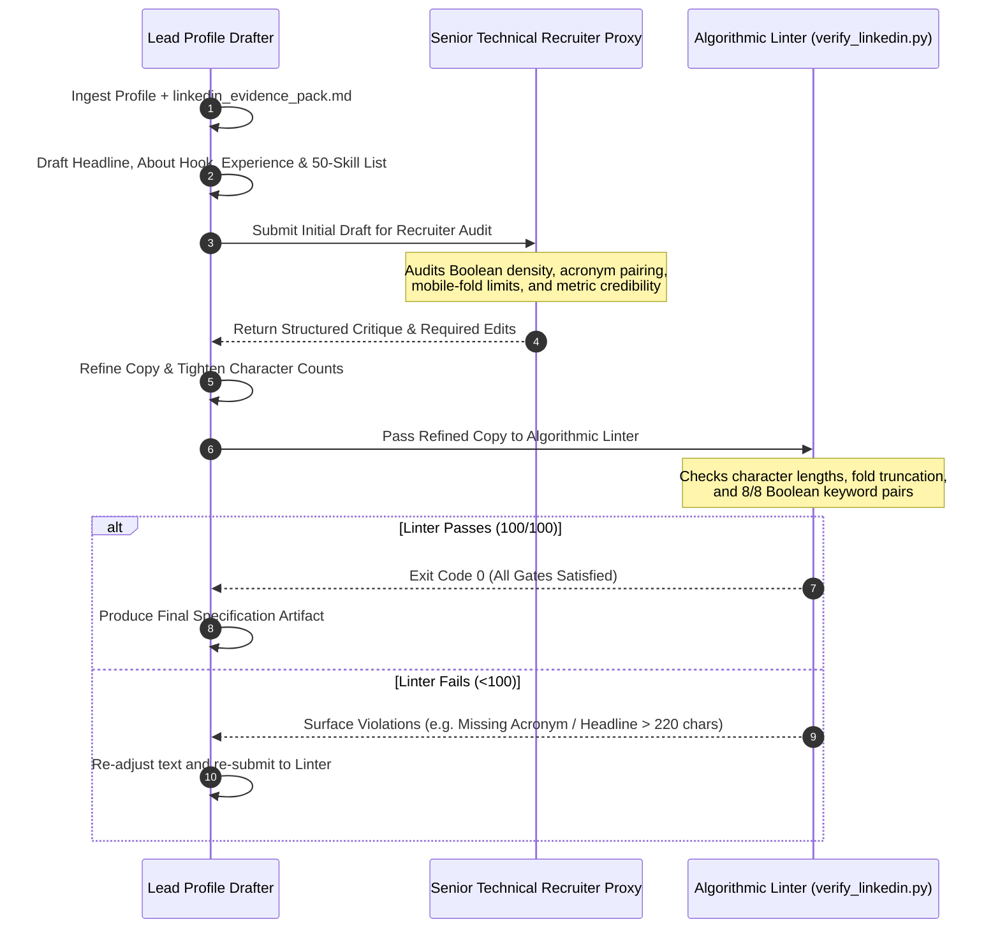

# LinkedIn Profile Optimizer — Architecture & System Workflow

The **LinkedIn Profile Optimizer** (`/linkedin-optimizer` or `/cmd-linkedin-optimizer`) is an enterprise-grade, multi-agent profile engineering subsystem built into the AI Job Search workspace. It transforms standard student or professional resumes into high-conversion inbound recruiter magnets.

Rather than treating LinkedIn as a static CV or generating generic AI marketing fluff, the LinkedIn Optimizer treats LinkedIn as an **AI-powered Semantic Skill Graph**. It combines **live primary-source grounding** via Google NotebookLM with an **adversarial dual-agent review cycle** and an **algorithmic linter** that enforces 2026 recruiter search indexing constraints.

---

## 1. High-Level Architecture Flowchart

The following flowchart visualizes the complete end-to-end execution lifecycle of the optimizer:

```mermaid
flowchart TD
    Start(["User Invocation:<br/><code>/linkedin-optimizer [generate]</code>"]) --> ModeSelect{"Mode Specified?"}
    
    %% Mode Selection & Discovery
    ModeSelect -- "No (Default)" --> DetectURL["Scan Candidate Profile & Resumes<br/>for Existing LinkedIn URL"]
    DetectURL --> FoundURL{"URL Found?"}
    FoundURL -- "Yes" --> SetReviewMode["Set Mode: <b>Profile Review</b>"]
    FoundURL -- "No" --> PromptUser["Prompt User:<br/>Review Existing or Generate New?"]
    PromptUser --> UserChoice{"User Choice"}
    UserChoice -- "Review" --> AskURL["Prompt User for Profile URL"] --> SetReviewMode
    UserChoice -- "Generate" --> SetGenMode["Set Mode: <b>Turnkey Generation</b>"]
    ModeSelect -- "generate [target]" --> SetGenMode
    
    %% Pre-Flight Health Check
    SetReviewMode --> PreFlight["Pre-Flight Diagnostic Check<br/>(<code>tools/check_extendlm.py</code>)"]
    SetGenMode --> PreFlight
    
    PreFlight --> AuthCheck{"ExtendLM MCP<br/>Active & Valid?"}
    AuthCheck -- "No / Expired" --> AutoAuth["Run <code>auth-extendlm</code><br/>Display Direct Browser OAuth URL"]
    AutoAuth --> ReCheck{"Authenticated?"}
    ReCheck -- "Yes" --> RAGStep
    ReCheck -- "No" --> HaltProtocol["<b>HALT WORKFLOW</b><br/>Zero Silent Failures<br/>(Override only with <code>--allow-fallback</code>)"]
    
    %% Adaptive RAG Grounding
    AuthCheck -- "Yes" --> RAGStep["Adaptive RAG Hook<br/>(<code>rag/linkedin_rag_hook.py</code>)"]
    RAGStep --> SourceFingerprint["List Sources & Compute<br/>SHA-256 Fingerprint"]
    SourceFingerprint --> CacheCheck{"Fingerprint Matches<br/>Domain Cache?"}
    CacheCheck -- "Hit" --> LoadCache["Load Categorized Domains<br/>from Local Cache"]
    CacheCheck -- "Miss / Updated" --> DynamicIntrospect["Introspect NotebookLM Domains<br/>(Academic, Professional, Homelab, Certs)"]
    DynamicIntrospect --> SaveCache["Update SHA-256 Cache File"]
    LoadCache --> QueryNotebook["Query Primary Evidence<br/>(Metrics, Configs, Tools, Course Codes)"]
    SaveCache --> QueryNotebook
    QueryNotebook --> GenEvidence["Generate Local Grounding Pack<br/>(<code>linkedin_evidence_pack.md</code>)"]
    
    %% Dual-Agent Optimization Loop
    GenEvidence --> DrafterAgent["<b>Lead Profile Drafter Agent</b><br/>• Drafts 220-char Headline<br/>• Drafts 2,600-char About Hook<br/>• Structures Experience & Homelab<br/>• Generates 50-Skill Taxonomy"]
    
    DrafterAgent --> ReviewerAgent["<b>Senior Technical Recruiter Proxy</b><br/>• Audits Boolean Search Density<br/>• Tests Mobile Fold Truncation<br/>• Checks Acronym/Full-Form Pairing<br/>• Validates Primary Evidence Proof"]
    
    ReviewerAgent --> ReviewCritique{"Meets 100/100<br/>Recruiter Heuristics?"}
    ReviewCritique -- "Revisions Needed" --> DrafterAgent
    
    %% Algorithmic Linter Verification
    ReviewCritique -- "Approved" --> LintVerification["Algorithmic Profile Linter<br/>(<code>tools/verify_linkedin.py</code>)"]
    LintVerification --> LintPass{"Linter Check<br/>Passed (Exit 0)?"}
    LintPass -- "Violations" --> DrafterAgent
    
    %% Deliverables
    LintPass -- "Passed" --> FinalOutput{"Active Mode"}
    FinalOutput -- "Review Mode" --> WriteReview["Write <code>linkedin/profile_review_report.md</code><br/>(Before/After Upgrades & Insights)"]
    FinalOutput -- "Generate Mode" --> WriteMaster["Write <code>LINKEDIN_PROFILE_MASTER.md</code><br/>(100/100 Drop-in Specification)"]
    
    WriteReview --> SyncProfile["Sync Verified Claims to<br/><code>01-candidate-profile.md</code>"]
    WriteMaster --> SyncProfile
    SyncProfile --> Done(["<b>Complete</b> — Ready for Deployment"])

    classDef primary fill:#2563eb,stroke:#1d4ed8,stroke-width:2px,color:#fff;
    classDef success fill:#16a34a,stroke:#15803d,stroke-width:2px,color:#fff;
    classDef warning fill:#d97706,stroke:#b45309,stroke-width:2px,color:#fff;
    classDef danger fill:#dc2626,stroke:#b91c1c,stroke-width:2px,color:#fff;
    class Start,Done primary;
    class WriteReview,WriteMaster,SyncProfile success;
    class AutoAuth,PromptUser warning;
    class HaltProtocol danger;
```



---

## 2. Core Subsystems & Technical Mechanics

### A. Discovery & Mode Selection
The optimizer intelligently determines user intent based on existing workspace artifacts:
1. **Default Review Mode**: Unless explicitly instructed to `generate`, the workflow assumes you want to review and upgrade an existing profile.
2. **Auto-Discovery**: It reads `.claude/skills/job-application-assistant/01-candidate-profile.md`, `CLAUDE.md`, and any resume in `cv/` or `documents/` to find your public LinkedIn URL.
3. **Interactive Fallback**: If no URL is found, it asks whether you want to provide your profile URL or generate a complete turnkey profile from scratch.

---

### B. Zero-Silent-Failure Pre-Flight Health Checks

To prevent generating ungrounded AI drafts due to stale credentials or disconnected browser sessions, the system runs an automated pre-flight health check before any RAG work begins:



* **CLI Commands:** `check-extendlm` (diagnostics) and `auth-extendlm` (authentication).
* **Self-Healing:** If an authorization token is expired, the system initiates the local OAuth callback listener and prints the authorization link directly in the chat UI.
* **Halt Guarantee:** If unauthenticated, the hook halts with Exit Code 1. It will never silently fallback to ungrounded guesswork unless `--allow-fallback` is explicitly provided.

---

### C. Adaptive RAG Grounding & SHA-256 Cache Invalidation

Grounding candidate achievements in primary documents (transcripts, lab reports, homelab configs, past reviews, certifications) is handled by [`rag/linkedin_rag_hook.py`](rag/linkedin_rag_hook.py).

Because different candidates have different evidence profiles (some are college students with academic coursework; others are seasoned professionals with corporate performance reviews), the RAG pipeline is **adaptive**:



#### Why Source Fingerprinting Matters:
1. **Blazing Speed:** When sources haven't changed, cached domain knowledge loads in milliseconds without redundant LLM round-trips.
2. **Zero Blindspots:** The moment a user uploads a new lab report, resume, or certificate to Google NotebookLM, the SHA-256 fingerprint changes, instantly triggering dynamic re-introspection.

---

## 3. Dual-Agent Recruiter Critique Cycle

The engine utilizes two specialized agents with conflicting, complementary goals:



* **Drafter Agent Objectives:** Highlight domain mastery, verified project deliverables, core methodologies and toolchains, quantifiable achievements, and operational soft skills.
* **Reviewer Agent Objectives:** Evaluate candidate from the perspective of an Enterprise Hiring Manager or Senior Talent Partner in the target industry. Eliminate fluff, ensure domain acronym pairing, test mobile folds, and maximize Boolean keyword density.

---

## 4. 2026 Recruiter Search Algorithm Heuristics

LinkedIn's Recruiter Search algorithm ranks candidate profiles against specific criteria:

| Gate | Algorithm Target | Optimization Rule |
| :--- | :--- | :--- |
| **Visible Headline Fold** | **First 65–70 characters** | Mobile search results truncate headlines early. The primary target title (e.g. `Systems Administrator Co-op / Intern`, `Senior Financial Analyst`, `Registered Nurse`) must appear before character 70. |
| **Headline Hard Limit** | **Max 220 characters** | Must include primary title, secondary domain competencies, honors/certifications, and institution/organization. |
| **Visible About Fold** | **First 280–300 characters** | Mobile apps and search summaries hide everything after 300 characters behind `"…see more"`. The first block must contain target title, availability, core domain expertise, and high-priority search keywords. |
| **About Hard Limit** | **Max 2,600 characters** | Packed with high-density bullet points, verified project deliverables, and direct contact details. |
| **Universal Boolean Acronym Pairing** | **ATS Query Compatibility** | Recruiters alternate between abbreviations and full terms in Boolean queries across every field. Both must appear in context: Tech (`API`, `VLAN`, `CI/CD`, `AWS`), Finance (`GAAP`, `EBITDA`, `ROI`), Healthcare (`EMR`, `HIPAA`, `BLS`), Marketing (`SEO`, `CTR`, `CRM`), Operations (`PMP`, `KPI`, `SLA`). |
| **Seniority & Search Alignment** | **Filter Coverage** | Strategically aligns terminology with recruiter habits (e.g., dual "Co-op / Internship" for early careers, or "Senior / Lead / Specialist" for experienced roles). |
| **50-Skill Taxonomy** | **Skill Graph Coverage** | The profile must fill all 50 skill slots across core competencies, software/tools, industry standards, and leadership. |
| **Spotlight Triggers** | **Priority Search Tabs** | Triggers "Open to Work", "More Likely to Respond", "Active Talent", and "Have Company Connections". |

---

## 5. Algorithmic Verification Engine (`tools/verify_linkedin.py`)

Every profile generated or reviewed is programmatically validated by an automated Python linter before completion:

```bash
python3 tools/verify_linkedin.py "LINKEDIN_PROFILE_MASTER.md"
```

The linter enforces strict programmatic pass/fail checks:
* **Character limits:** Headline (≤ 220), About (≤ 2,600), Experience (≤ 2,000).
* **Fold previews:** Displays exactly what a recruiter sees on a smartphone screen before clicking "…see more".
* **Multi-Industry Acronym audit:** Cross-references profile against universal multi-industry dictionary (covering Tech, Finance, Healthcare, Marketing, Operations, and Compliance) and auto-detects inline `Full Term (ACRONYM)` pairs.
* **50-skill taxonomy audit:** Categorizes and counts all technical skills.
* **Recruiter Readiness Score:** Calculates a transparent 0–100 score based on Boolean indexability and metric density.

---

## 6. Privacy & Anti-Leak Safeguards

To prevent candidate personal information (phone numbers, personal emails, physical addresses, or custom vanity URLs) from leaking into public Git repositories:

1. **Ignored Personal Output:** All master profile outputs are explicitly excluded in `.gitignore`:
   ```gitignore
   linkedin_profile_master.md
   LINKEDIN_PROFILE_MASTER.md
   linkedin_profile_master.*
   linkedin/
   resume_master.md
   resume_master.*
   career_evidence_pack.md
   linkedin_evidence_pack.md
   rag/cache/
   ```
2. **Safe Local Persistence:** Your customized drop-in specification remains safely stored on your local disk at `LINKEDIN_PROFILE_MASTER.md` and `linkedin/linkedin_profile_master.md` for easy copying into the LinkedIn web interface, but will **never be tracked or committed to Git**.
3. **Generic Repository Documentation:** All public playbooks, guides, and example code use placeholder credentials (`[Your Name]`, `your.email@example.com`).

---

## 7. Command Reference & Usage

### Review Mode (Default)
```bash
/linkedin-optimizer
```
* Scans workspace for candidate LinkedIn URL.
* Queries live evidence from Google NotebookLM via ExtendLM.
* Produces `linkedin/profile_review_report.md` detailing score, recruiter critique, and drop-in text upgrades.

### Turnkey Generation Mode
```bash
/linkedin-optimizer generate "IT Systems Administrator"
```
* Synthesizes full evidence pack into a 100/100 drop-in profile specification (`LINKEDIN_PROFILE_MASTER.md`).
* Formats banner text, photo guidelines, headline options, About section, featured projects, enterprise experience, recommendations, and 50 skills.

### Diagnostic & Pre-Flight Tooling
```bash
# Test ExtendLM MCP health and verify active sources:
check-extendlm

# Refresh OAuth credentials if expired:
auth-extendlm

# Verify any LinkedIn markdown profile specification against 2026 algorithms:
python3 tools/verify_linkedin.py <path_to_profile.md>
```
