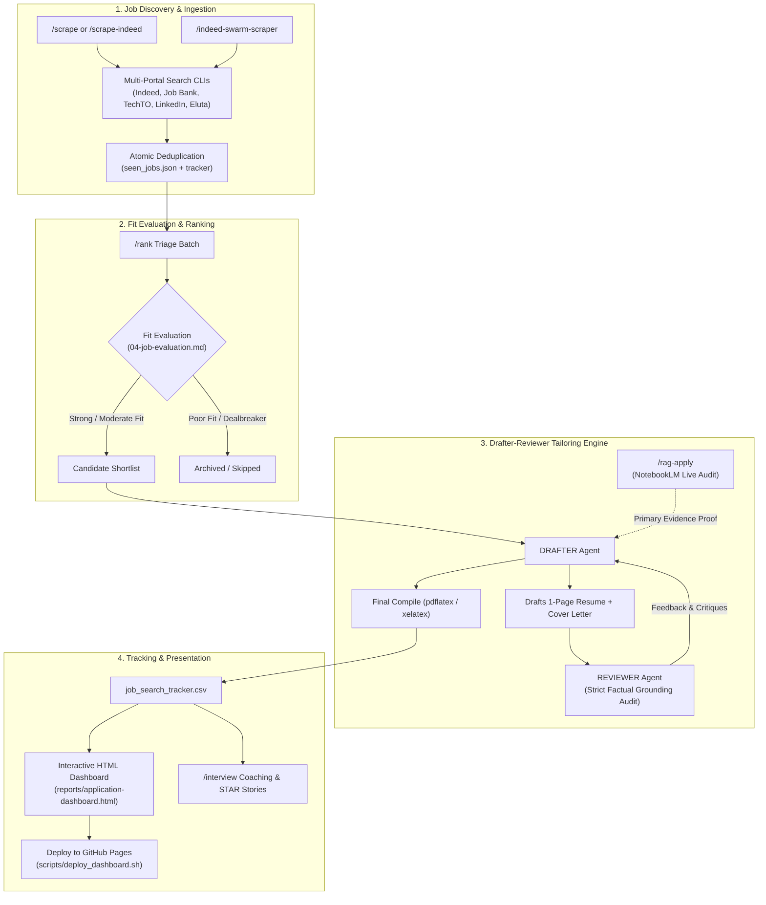

# AI Job Search Enhanced 🚀

*The autonomous, AI-powered job search operating system that runs entirely on your local machine.*

[](https://github.com/StickwoodJr/ai-job-search-enhanced/actions)
[](LICENSE)
[](https://www.python.org/downloads/)
[](AGENTS.md)

An intelligent, multi-agent framework built for **[Claude Code](https://claude.com/claude-code)** and **[Google Antigravity](https://github.com/google-deepmind)** (and compatible with Codex, Cursor, and Gemini CLI). It automates the entire job hunt: scrapes multiple job boards, evaluates posting fit, tailors verified LaTeX resumes and cover letters, grounds achievements in real career evidence (certifications, personal projects, past resumes, coursework) via live Career Evidence RAG, prepares you for interviews, and deploys a live personal analytics dashboard.

---

## 🐣 New to AI Agents? Start Here (Zero Experience Required)

You do **not** need to be a programmer or know how to configure complex environments. If you have an AI coding assistant such as **Google Antigravity** or **Claude Code**, getting started takes 30 seconds.

### Step 1 — Gather your documents

Before anything else, collect any files that capture your experience and drop them somewhere easy to find (a folder on your Desktop works fine). These could be:

- Your current resume or any past resumes
- Certifications or credential PDFs
- Course notes, syllabi, or lab write-ups
- Personal project write-ups or READMEs
- Publications, blog posts, or portfolio links saved as text/PDF

> [!TIP]
> The more context the agent has about you, the more accurate and personalized your resumes and cover letters will be. You can always add more documents later.

### Step 2 — Tell your agent to set everything up

Open **Google Antigravity** or **Claude Code**, and send this single prompt:

```text
Clone https://github.com/StickwoodJr/ai-job-search-enhanced and set everything up for me
```

Your agent will:
1. Clone the repository to your machine.
2. Run the automated setup wizard (`python3 tools/setup_wizard.py --doctor`).
3. Check and install all necessary dependencies and portal search scrapers.
4. Copy your documents into the project's `documents/` folder and register them as your career evidence sources.
5. Ask you a few quick questions (name, location, target roles, primary skills).
6. Choose your target market (North American 1-Page Jake's Resume vs European 2-Page ModernCV).
7. Compile and verify your first test PDF resume!

---

## 🛠️ Alternative: Quick Manual Setup (Terminal)

### 1. Fork and clone

```bash
gh repo fork StickwoodJr/ai-job-search-enhanced --clone
cd ai-job-search-enhanced
```

> [!IMPORTANT]
> **A fork of this repo is always public** — GitHub does not allow private forks of
> public repositories — and `/setup` writes your personal data (name,
> contact details, employment history, salary expectations) into **tracked** files.
> If this copy is for your own job search rather than for contributing changes back,
> use a **private repository** with this repo as `upstream` instead — the two-minute
> recipe is in [SETUP.md section 8](SETUP.md#8-pulling-upstream-updates-into-your-fork),
> and every update workflow works identically. Fork only to contribute.

### 2. Run the interactive setup wizard

```bash
python3 tools/setup_wizard.py
```

The wizard checks your Python version, package managers (Bun/npm), and LaTeX compilers (`pdflatex`, `xelatex`, `lualatex`), installs all search tools, and configures your initial profile.

---

## ⚡ What Makes This "Enhanced"?

This repository builds on the excellent foundations of [MadsLorentzen/ai-job-search](https://github.com/MadsLorentzen/ai-job-search) and [MadCkull/J-Argus](https://github.com/MadCkull/J-Argus), incorporating major upgrades:

| Feature | Description |
|---|---|
| 🤖 **Native Antigravity & Claude Code Support** | Unified thin-pointer architecture (`.agents/skills/` and `.claude/commands/`) with full cross-runtime compatibility. Works identically in Antigravity and Claude Code. |
| 🍁 **Canadian & North American Market Ready** | Out-of-the-box search skills for **Indeed Canada**, **Job Bank Canada**, **TechTO Jobs**, **Talent.com**, **Eluta.ca**, and **GC Jobs (Federal Government of Canada)**, alongside **LinkedIn** and **Freehire**. |
| 📄 **1-Page Jake's Resume Template (`pdflatex`)** | Standard single-page, ATS-optimized North American resume template (`cv/jakes_resume_template.tex`) that compiles cleanly and fast with `pdflatex`. (European 2-page ModernCV still fully supported). |
| 🐝 **Indeed Swarm Scraper** | High-performance multi-sector scraper (`/indeed-swarm-scraper`) that partitions search across customizable industry sectors (Software, Systems, Data, Operations, or Custom) with atomic deduplication and automatic tracker updates. |
| 🎯 **Personal Knowledge & Evidence RAG (NotebookLM)** | Live, zero-cache retrieval augmented generation (`/rag-apply`) querying primary evidence from your personal notebook (certifications, personal projects, coursework, past resumes) via Google NotebookLM & ExtendLM MCP to back up resume claims with verified proof. |
| 📊 **Interactive HTML Analytics Dashboard** | Standalone responsive dashboard with multi-board filtering (Indeed, Job Bank, LinkedIn, TechTO), pipeline funnel analytics, and one-click GitHub Pages deployment (`scripts/deploy_dashboard.sh`). |
| 🔄 **Automated Scrape & Apply Loop** | Continuous background daemon (`auto_scrape_and_apply.py`) that periodically sweeps job boards, evaluates fit, and prepares tailored application drafts. |

---

## 🧭 How the Workflow Operates



---

## 🎯 Command Reference & Agent Prompts

You can control the entire framework by running slash commands in **Claude Code** or by speaking naturally in **Google Antigravity**:

| Workflow | Claude Code Slash Command | How to Ask Antigravity | What It Does |
|---|---|---|---|
| **Setup & Onboard** | `/setup` | *"Set everything up for me"* | Checks environment, installs search tools, and configures profile. |
| **Indeed Scrape** | `/scrape-indeed` | *"Search Indeed Canada for postings matching my target role"* | Sweeps Indeed, deduplicates, and evaluates candidate fit against your profile. |
| **Swarm Scrape** | `/indeed-swarm-scraper` | *"Run the indeed swarm scraper"* | Partitions search across sectors configured in `config/swarm_sectors.json`. |
| **Multi-Portal Scrape** | `/scrape` | *"Find new job postings matching my profile"* | Searches across all configured job boards (Job Bank, LinkedIn, etc.). |
| **Batch Triage** | `/rank` | *"Rank scraped jobs and make a shortlist"* | Scores new postings (0-100) and produces a prioritized application queue. |
| **Standard Apply** | `/apply <url_or_text>` | *"Apply to this posting: <url>"* | Two-agent drafter-reviewer workflow generating tailored 1-page LaTeX CV & letter. |
| **Evidence RAG Apply** | `/rag-apply <url_or_text>` | *"Apply with RAG to: <url>"* | Evaluates job, queries Google NotebookLM for primary career evidence proof, and drafts verified resume. |
| **Interview Prep** | `/interview <company>` | *"Prepare me for an interview at <company>"* | Generates company dossier, STAR stories, tough questions, and mock interview. |
| **Record Outcome** | `/outcome <company>` | *"I got an interview at <company>"* | Updates application status, archives submitted materials, or prepares follow-ups. |
| **Interactive Dashboard** | `/html-report` | *"Generate my job search dashboard"* | Builds responsive HTML report and deploys to GitHub Pages via `scripts/deploy_dashboard.sh`. |

---

## 🎯 Personal Knowledge & Career Evidence RAG with Google NotebookLM

This fork includes the **Career Evidence RAG** pipeline.

When applying to positions, generic bullet points fail to demonstrate real competence. The RAG engine connects your local agent to your primary career evidence—certifications, personal projects, coursework, past performance reviews, code repositories, and resumes stored in **Google NotebookLM** via **ExtendLM MCP**:

1. **Zero Caching Policy**: Every query executes live against your evidence notebook to ensure 100% data fidelity.
2. **Primary Evidence Extraction**: Pulls verified details, tools used, architecture decisions, certification IDs, and quantitative metrics directly from your source documents.
3. **Factual Grounding Audit**: Generates a `career_evidence_pack.md` that proves every claim before it is added to your resume, guaranteeing zero AI hallucinations.

See [`rag/README.md`](rag/README.md) for full setup and architecture details.

---

## 📊 Live Interactive Dashboard & GitHub Pages

Track your entire job search funnel offline or publish a live dashboard to GitHub Pages:

- **Local Preview**: Open `reports/application-dashboard.html` directly in any web browser.
- **Publish to GitHub Pages**: Run `./scripts/deploy_dashboard.sh` to automatically build and deploy your metrics to a GitHub Pages repository (or custom branch).
- **Multi-Board Tagging**: Instantly filter applications by job board (Indeed, Job Bank, TechTO, LinkedIn, Eluta).

---

## 💻 Prerequisites

- **AI Agent Tool**: [Google Antigravity](https://github.com/google-deepmind) or [Claude Code](https://claude.com/claude-code) CLI.
- **Python**: 3.10+ (`python3 --version`).
- **Package Manager**: [Bun](https://bun.sh) (recommended for blazing fast search CLIs) or Node/npm.
- **LaTeX Engine**:
  - `pdflatex` (for North American 1-Page Jake's Resume in `cv/jakes_resume_template.tex`)
  - `xelatex` (for Cover Letters using `cover.cls` and `fontspec`)
  - `lualatex` (for European 2-Page ModernCV in `cv/main_example.tex`)
  - *Distributions*: [TeX Live](https://tug.org/texlive/) (Linux/Windows), [TinyTeX](https://yihui.org/tinytex/) (Minimal cross-platform), or [MacTeX](https://tug.org/mactex/) (macOS).

---

## 🔒 Privacy First

Your job search data is **yours**.
- This template ships with strict [.gitignore](.gitignore) rules that prevent your personal contact info, phone number, address, tracker CSV, application drafts, and Google Sheets configs from ever being committed to a public repository.
- Built-in security guards (`python3 tools/security_guards.py`) continuously enforce placeholder integrity.

---

## 🤝 Upstream & Acknowledgements

This repository is an enhanced public fork building upon the foundational work of:
- **[Mads Lorentzen](https://github.com/MadsLorentzen/ai-job-search)**: Original author and creator of the AI Job Search multi-agent framework.
- **[Hassan Ali (MadCkull)](https://github.com/MadCkull/J-Argus)**: Pioneer of the thin-pointer cross-runtime architecture bringing Antigravity support to AI Job Search.
- **[Jake Gutierrez](https://github.com/jakegut/resume)**: Creator of the widely-adopted Jake's Resume LaTeX template.

---

## 📄 License

MIT License — see [LICENSE](LICENSE) for details.
