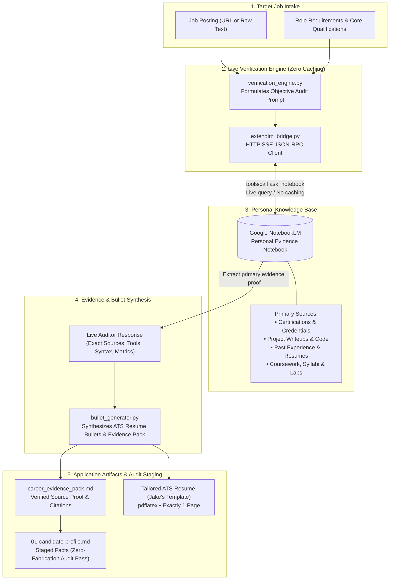

# Personal Knowledge & Evidence RAG: Grounding via ExtendLM NotebookLM

This module implements a **Retrieval-Augmented Generation (RAG)** pipeline that connects your job search assistant directly to your personal knowledge base in **Google NotebookLM** via **ExtendLM MCP**.

It enables the `/rag-apply` workflow to extract, verify, and format high-fidelity resume bullets and cover letter narratives grounded in real source documents with zero AI hallucination.

> [!NOTE]
> **Use With Any Source Materials**:
> This RAG pipeline is domain-agnostic and designed for any candidate background. You can upload any materials to your NotebookLM knowledge base:
> - **Professional Certifications & Credentials** (AWS, Azure, CompTIA, PMP, Cisco, Google Cloud, Salesforce, etc.)
> - **Personal & Open-Source Projects** (code repositories, architecture decision records, READMEs, homelab topologies, design docs)
> - **Past Resumes & Performance Reviews** (achievements, metrics, leadership responsibilities, awards)
> - **Educational Coursework & Labs** (syllabi, practical assignments, command logs, capstone projects, transcripts)
> - **Reference Letters & Recommendations** (quotes, feedback, competencies)

---

## How It Works

The flowchart below illustrates the end-to-end verification and tailoring lifecycle:



---

## Core Design Principles

1. **Zero Caching Policy**:
   - **No RAG data or query responses are cached on disk or in memory**.
   - Every verification executes fresh and live against Google NotebookLM to ensure 100% data fidelity, accurate cross-referencing, and context tailored to each individual job.
2. **Per-Resume & Per-Job Dynamic Verification**:
   - The engine analyzes the specific target role and technical requirements, prompting NotebookLM as an auditor to identify exact certifications, project deliverables, tools, commands, and environments you have worked with.
3. **Factual Grounding Audit Compliance**:
   - The framework enforces strict zero-fabrication audits. The generated **Career Evidence Pack** provides exact citations to primary source materials so that when verified facts are staged into `01-candidate-profile.md`, they pass audits seamlessly.

---

## Architecture

| File | Purpose |
|------|---------|
| `config.py` | Target notebook IDs, ExtendLM MCP endpoint, and connection parameters. |
| `notebook_manager.py` | CLI tool to list notebooks, select active notebook, inspect sources, and scan `documents/`. |
| `extendlm_bridge.py` | Low-level JSON-RPC client over HTTP SSE for ExtendLM MCP (`tools/call`, `ask_notebook`). |
| `source_catalog.py` | Dynamic source classifier for indexing certifications, projects, coursework, and past experience. |
| `verification_engine.py` | Orchestrates live, dynamic prompt generation and execution against NotebookLM with zero caching. |
| `bullet_generator.py` | Transforms verified evidence into LaTeX ATS resume bullets (`\resumeItem`), cover letter narratives, and markdown evidence packs. |
| `rag_cli.py` | Standalone CLI for testing, catalog exploration, and live verification. |
| `apply_rag_hook.py` | Bridge script callable during `cmd-apply` Step 1 & Step 2. |

---

## Quickstart

### 1. Set Up Your NotebookLM Notebook
1. Go to [notebooklm.google.com](https://notebooklm.google.com)
2. Create a new notebook titled **"Personal Knowledge & Career Evidence"**
3. Upload your materials: drop in past resumes, certification PDFs, project notes, lab write-ups, or reference letters
4. Copy the Notebook ID from your browser URL: `https://notebooklm.google.com/notebook/<NOTEBOOK_ID>`

### 2. Configure in AI Job Search
Run:
```bash
python rag/notebook_manager.py select <NOTEBOOK_ID> "Personal Knowledge & Career Evidence"
```

### 3. Apply with Verified RAG Proof
```bash
# In Claude Code:
/rag-apply https://example.com/job-posting

# In Antigravity:
"Apply with RAG to this posting: https://example.com/job-posting"
```
